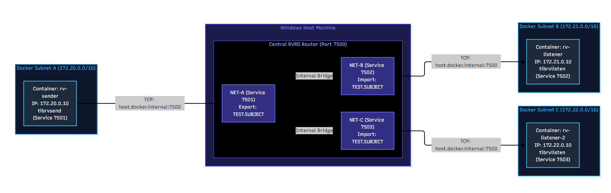
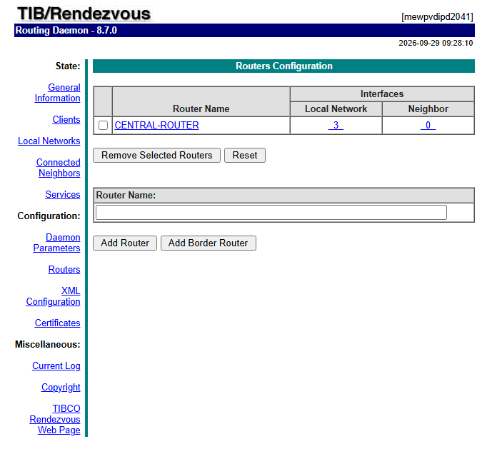
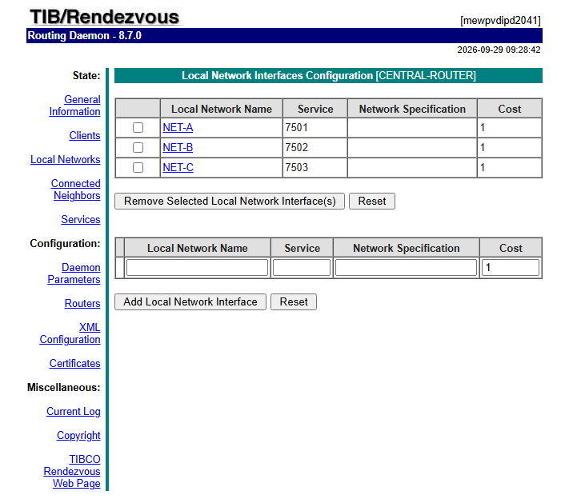

# TIBCO RENDEZVOUS: MULTI-SUBNET DOCKER ROUTING (RVRD) TEST

This project demonstrates a proof-of-concept for routing TIBCO Rendezvous (RV) messages between three completely isolated Docker bridge networks (Subnets A, B, and C) using a central Routing Daemon (rvrd) running on the Windows host machine.

Since standard TIBCO RV relies on UDP multicast/broadcast, it cannot natively cross the network boundaries established by Docker subnets. By configuring the containerized applications to connect via TCP directly to the host rvrd (acting as a central hub), we can bridge these subnets.


## ARCHITECTURE DIAGRAM



## PREREQUISITES

* Docker Desktop: Installed and running on Windows.
* TIBCO Rendezvous (Host): Installed on the Windows host machine.
* TIBCO License File: Available at C:\Users\dmassimi\containers\resources\addons\license\dmassimi-vdi_ANY.bin
* TIBCO Docker Image: A working Docker image tagged tibco-rv:9.0.0 available locally.


## PROJECT FILES: docker-compose.yml

```yaml
services:
  # 1. Publisher Container on Subnet A (Service 7501)
  rv-sender:
    image: tibco-rv:9.0.0
    container_name: rv-sender
    hostname: localhost
    volumes:
      - C:\Users\dmassimi\containers\resources\addons\license:/data/license
    environment:
      - TIBRV_LICENSE=file:///data/license/dmassimi-vdi_ANY.bin
    command: >
      bash -c "tibrvlisten -service 7501 -daemon tcp:host.docker.internal:7500 TEST.ACK & sleep 2; while true; do echo 'Publishing to NET-A...'; tibrvsend -service 7501 -daemon tcp:host.docker.internal:7500 TEST.SUBJECT 'Hello from Subnet A!'; sleep 5; done"
    extra_hosts:
      - "host.docker.internal:host-gateway"
    networks:
      subnet_a:
        ipv4_address: 172.20.0.10

  # 2. First Subscriber Container on Subnet B (Service 7502)
  rv-listener:
    image: tibco-rv:9.0.0
    container_name: rv-listener
    hostname: localhost
    volumes:
      - C:\Users\dmassimi\containers\resources\addons\license:/data/license
    environment:
      - TIBRV_LICENSE=file:///data/license/dmassimi-vdi_ANY.bin
    command: >
      bash -c "tibrvlisten -service 7502 -daemon tcp:host.docker.internal:7500 TEST.SUBJECT"
    extra_hosts:
      - "host.docker.internal:host-gateway"
    networks:
      subnet_b:
        ipv4_address: 172.21.0.10

  # 3. Second Subscriber Container on Subnet C (Service 7503)
  rv-listener-2:
    image: tibco-rv:9.0.0
    container_name: rv-listener-2
    hostname: localhost
    volumes:
      - C:\Users\dmassimi\containers\resources\addons\license:/data/license
    environment:
      - TIBRV_LICENSE=file:///data/license/dmassimi-vdi_ANY.bin
    command: >
      bash -c "tibrvlisten -service 7503 -daemon tcp:host.docker.internal:7500 TEST.SUBJECT"
    extra_hosts:
      - "host.docker.internal:host-gateway"
    networks:
      subnet_c:
        ipv4_address: 172.22.0.10

networks:
  subnet_a:
    ipam:
      config:
        - subnet: 172.20.0.0/16
  subnet_b:
    ipam:
      config:
        - subnet: 172.21.0.0/16
  subnet_c:
    ipam:
      config:
        - subnet: 172.22.0.0/16

```

## CONFIGURATION & EXECUTION STEPS


**Step 1: Start Host rvrd**

1. Open a command prompt on your Windows host.
2. Start the Routing Daemon listening on port 7500 with the HTTP interface enabled on 7580:
```bash
   rvrd -listen tcp:7500 -http 7580
```

**Step 2: Configure the rvrd Router & Local Networks**

Open http://localhost:7580 in your browser to access the RVRD Web UI. 
Navigate to Configuration -> Routers and create a router named CENTRAL-ROUTER (click Add Router) if it does not already exist. The three local network interfaces added below are attached to this router:



Next, go to Configuration -> Routers -> Local Networks.
Click Add Local Network three times to create the following entries:
* Name: NET-A, Service: 7501, Daemon: tcp:7500
* Name: NET-B, Service: 7502, Daemon: tcp:7500
* Name: NET-C, Service: 7503, Daemon: tcp:7500



**Step 3: Configure Subject Routing Rules**

1. In the Local Networks table, click on NET-A:
   * Under Export Subject List, click Add Export Subject.
   * Type: TEST.SUBJECT
   * Ensure Export Default Policy is set to Discard.
2. Return to Local Networks, click on NET-B:
   * Under Import Subject List, click Add Import Subject.
   * Type: TEST.SUBJECT
   * Ensure Import Default Policy is set to Discard.
3. Return to Local Networks, click on NET-C:
   * Under Import Subject List, click Add Import Subject.
   * Type: TEST.SUBJECT
   * Ensure Import Default Policy is set to Discard.

**Step 4: Start Containers**

Open a terminal in the directory containing your docker-compose.yml file and run:
docker-compose up -d --force-recreate


## VERIFICATION

To verify that routing is working, observe the logs of the subscriber containers.

Terminal 1 (rv-listener on Subnet B):
`docker logs -f rv-listener`

Expected Output: 
```console
2026-09-28 10:01:11: subject=TEST.SUBJECT, message={DATA="Hello from Subnet A!"}
```
Terminal 2 (rv-listener-2 on Subnet C):
`docker logs -f rv-listener-2`


Expected Output: 

```console
2026-09-28 10:01:11: subject=TEST.SUBJECT, message={DATA="Hello from Subnet A!"}
```

The test is successful if a single message published by rv-sender is simultaneously received by both rv-listener and rv-listener-2, despite all three containers existing on completely isolated network subnets.
